# 📊 Marketing Analytics Learning Program
### *Complete Project Structure for Client-Focused Marketing Data Analytics Tools and Skill Knowledge*
#### *Based on https://roadmap.sh/data-analyst* 
---

## 🎯 Project Overview

This comprehensive learning program is designed to build marketing analytics expertise across **Tableau, Power BI, Python, SQL, and Machine Learning** using real-world datasets that mirror our Inferno client scenarios.

### 🏢 **Target Clients**
- **🚚 FedEx** - Logistics & Supply Chain Analytics
- **💊 AnovoRx** - Specialty Pharma & Patient Analytics  
- **🏥 ATEC Spine** - MedTech & Surgical Analytics
- **⚕️ Campbell Clinic** - Orthopedic Healthcare Services

---

## 📁 Project Structure

```
Marketing Analytics Learning Program/
├── 00_Planning_Guide/              # 📚 All planning documents and guides
├── 01_Data_Sources/                # 📊 Kaggle datasets and sample data
├── 02_Module_Excel/                # 📊 Excel analytics fundamentals
├── 03_Tools_Setup/                 # 🛠️ Installation guides and configurations
├── 04_Module_Tableau/              # 📈 Tableau dashboard development
├── 05_Module_PowerBI/              # ⚡ Power BI reporting and KPIs
├── 06_Module_Python_Jupyter/       # 🐍 Python analytics and segmentation
├── 07_Module_SQL/                  # 🗃️ SQL queries and database analysis
├── 08_Module_Machine_Learning/     # 🤖 Predictive modeling and ML
├── 09_Client_Projects/             # 🏢 Client-specific project implementations
├── 10_Portfolio_Development/       # 🎨 Case studies and presentations
└── 11_Resources_Templates/         # 📋 Reusable templates and libraries
```

---

## 🗺️ Learning Roadmap & Flowchart

```mermaid
flowchart TD
    A[📋 Start: Planning & Setup] --> B[🛠️ Tools Installation]
    B --> C[📊 Data Sources Setup]
    C --> D[📈 Excel Fundamentals]
    
    D --> E[📊 Tableau Mastery]
    D --> F[⚡ Power BI Skills]
    D --> G[🐍 Python Analytics]
    
    E --> H[🗄️ SQL Database Skills]
    F --> H
    G --> H
    
    H --> I[🤖 Machine Learning]
    I --> J[🏢 Client Projects]
    
    J --> K[📋 FedEx Logistics]
    J --> L[💊 AnovoRx Healthcare]
    J --> M[🦴 ATEC Spine/Campbell]
    
    K --> N[📁 Portfolio Development]
    L --> N
    M --> N
    
    N --> O[🎯 Advanced Applications]
    O --> P[🏆 Professional Certification]
    
    style A fill:#e1f5fe
    style D fill:#fff3e0
    style E fill:#f3e5f5
    style F fill:#e8f5e8
    style G fill:#fff8e1
    style H fill:#fce4ec
    style I fill:#e0f2f1
    style J fill:#f1f8e9
    style N fill:#e8eaf6
    style P fill:#ffebee
```



### 🎯 **Skill Progression Map**

| **Phase** | **Core Skills** | **Tools Mastered** | **Client Focus** | **Deliverables** |
|-----------|-----------------|-------------------|------------------|------------------|
| **Foundation** | Data literacy, Excel mastery | Excel, Basic SQL | All clients | Interactive dashboards |
| **Visualization** | Chart design, storytelling | Tableau, Power BI | FedEx, AnovoRx | Executive presentations |
| **Programming** | Python, statistical analysis | Jupyter, pandas, matplotlib | ATEC Spine | Automated reports |
| **Database** | Query optimization, data modeling | SQL, database design | Cross-client | Data pipelines |
| **Advanced** | Machine learning, predictive analytics | scikit-learn, MLflow | All clients | Predictive models |
| **Integration** | End-to-end projects | Full stack | Client-specific | Portfolio projects |

### 📊 **Learning Pathway Options**

```mermaid
flowchart LR
    subgraph "🚀 Fast Track (8 weeks)"
        FT1[Excel + Tableau] --> FT2[Python + SQL] --> FT3[Client Projects]
    end
    
    subgraph "📚 Comprehensive (11 weeks)"
        CT1[Excel] --> CT2[Tableau] --> CT3[Power BI] --> CT4[Python] --> CT5[SQL] --> CT6[ML] --> CT7[Projects]
    end
    
    subgraph "🎯 Specialized Tracks"
        ST1[📊 Visualization Track<br/>Excel → Tableau → Power BI]
        ST2[🐍 Programming Track<br/>Python → SQL → ML]
        ST3[🏥 Healthcare Track<br/>AnovoRx → Campbell Clinic]
        ST4[🚚 Logistics Track<br/>FedEx Focus]
    end
```



---

## 🚀 Learning Path

### **📅 Phase 1: Foundation (Weeks 1-4)**
1. **Week 1:** Review planning guides, set up tools, download datasets
2. **Week 2:** Complete Module Excel - Client-focused Excel analytics
3. **Week 3:** Complete Module Statistics - Statistical foundations
4. **Week 4:** Complete Tableau Module - FedEx logistics dashboard

### **📅 Phase 2: Core Skills (Weeks 5-8)**
5. **Week 5:** Complete PowerBI Module - AnovoRx healthcare KPIs
6. **Week 6:** Complete Python Module - ATEC Spine segmentation
7. **Week 7:** Complete SQL Module - Cross-client query practice
8. **Week 8:** Complete Machine Learning Module - Predictive analytics projects

### **📅 Phase 3: Client Projects (Weeks 9-10)**
9. **Week 9:** Build comprehensive client-specific projects
10. **Week 10:** Develop portfolio case studies and presentations

### **📅 Phase 4: Advanced Applications (Weeks 11-12)**
11. **Week 11:** Advanced analytics and cross-platform integration
12. **Week 12:** Portfolio refinement and presentation preparation

---

## ✅ Overall Progress Checklist

### **🔧 Setup & Preparation**
- [ ] Review all planning documents in `00_Planning_Guide/`
- [ ] Install required tools (see `03_Tools_Setup/`)
- [ ] Download all datasets from Kaggle (see `01_Data_Sources/`)
- [ ] Set up development environment

### **📚 Module Completion**
- [ ] **Tableau Module:** FedEx logistics dashboard
- [ ] **Power BI Module:** AnovoRx healthcare KPIs
- [ ] **Python Module:** ATEC Spine customer segmentation
- [ ] **SQL Module:** Cross-client query mastery
- [ ] **Machine Learning Module:** Predictive models

### **🏢 Client Projects**
- [ ] **FedEx:** Campaign optimization and churn prediction
- [ ] **AnovoRx:** Patient adherence and treatment analytics
- [ ] **ATEC Spine:** Device adoption and physician analytics
- [ ] **Campbell Clinic:** Community engagement and satisfaction

### **🎨 Portfolio Development**
- [ ] Create case studies for each client project
- [ ] Develop executive presentation materials
- [ ] Document methodologies and best practices
- [ ] Build reusable templates and frameworks

---

## 🎯 Success Metrics

### **📊 Technical Proficiency**
- [ ] Build interactive dashboards in under 2 hours
- [ ] Write complex SQL queries for business analysis
- [ ] Implement machine learning models with 80%+ accuracy
- [ ] Create automated reporting workflows

### **🏢 Business Impact**
- [ ] Identify optimization opportunities worth 15%+ ROI improvement
- [ ] Generate actionable insights from data analysis
- [ ] Provide strategic recommendations based on findings
- [ ] Demonstrate measurable client value

---

## 📞 Getting Started

1. **Start Here:** Read all documents in `00_Planning_Guide/`
2. **Set Up Tools:** Follow instructions in `02_Tools_Setup/`
3. **Get Data:** Download datasets using `01_Data_Sources/README.md`
4. **Begin Learning:** Start with `04_Module_Tableau/`

---

**🎯 Ready to transform your marketing analytics capabilities? Follow the numbered folders sequentially and check off each milestone as you progress!**
